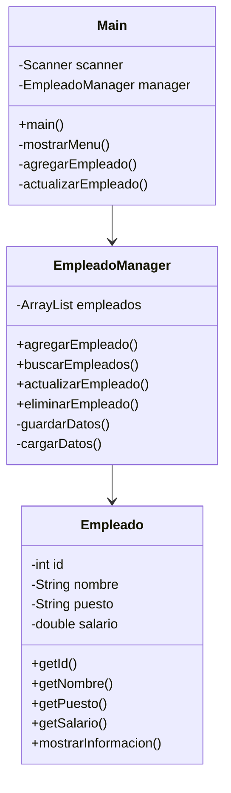
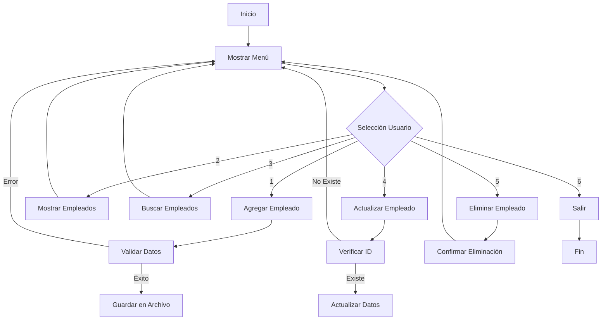

# Sistema de Gestión de Empleados
## Presentación del Proyecto

---

### Estructura de la Aplicación

---

### Conceptos Aplicados

1. **Programación Orientada a Objetos**
   - Encapsulación
   - Clases y Objetos
   - Métodos y Atributos

2. **Gestión de Datos**
   - Serialización
   - Persistencia
   - Validación

3. **Diseño de Software**
   - Separación de Responsabilidades
   - Patrón Manager
   - Interfaz de Usuario

---

### Métodos Principales

#### Clase Empleado
- Constructor
- Getters y Setters
- mostrarInformacion()

#### Clase EmpleadoManager
- CRUD Operations
  * Create (agregarEmpleado)
  * Read (buscarEmpleados)
  * Update (actualizarEmpleado)
  * Delete (eliminarEmpleado)
- Persistencia de Datos
  * guardarDatos()
  * cargarDatos()

---

### Flujo de la Aplicación

---

### Características Destacadas

1. **Validación de Datos**
   - Control de tipos de datos
   - Verificación de ID únicos
   - Manejo de errores

2. **Persistencia**
   - Almacenamiento en archivo
   - Recuperación automática
   - Serialización de objetos

3. **Interfaz de Usuario**
   - Menú interactivo
   - Feedback claro
   - Opciones intuitivas

---

### Pruebas y Resultados

- **Operaciones CRUD**
  * Creación exitosa de empleados
  * Búsqueda por diferentes criterios
  * Actualización de datos
  * Eliminación segura

- **Manejo de Errores**
  * Validación de entradas
  * Mensajes informativos
  * Recuperación de errores

---

### Conclusiones

- Sistema robusto y funcional
- Código mantenible y organizado
- Implementación de mejores prácticas
- Base para futuras mejoras
